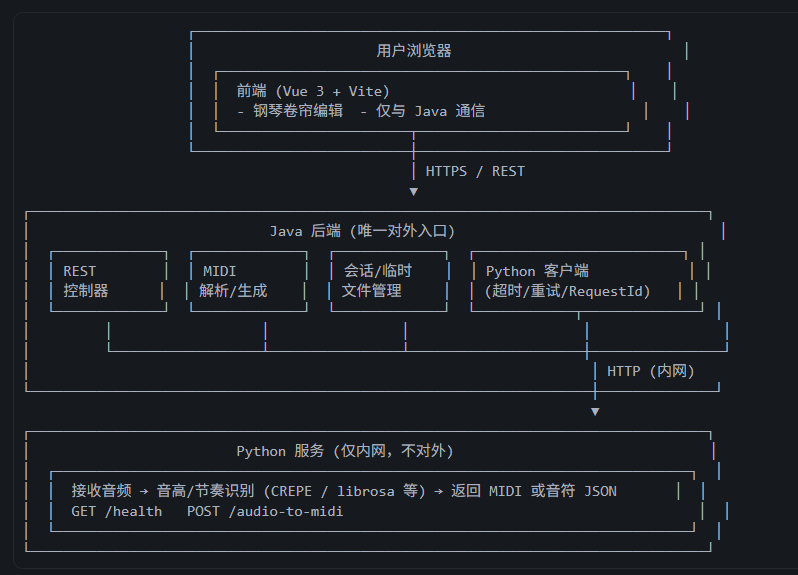

# 业务场景
一个基于网页的 MIDI 编辑器，我希望这个 midi 编辑器能够对用户输入的现成 midi 进行修改，或是直接在这个 midi 编辑器里制作生成一个新的 midi,让用户可以简单编辑音符、试听，并导出 MIDI 文件或 mp3 文件。

# 整体架构

- 前端：只和 Java 对话（上传 MIDI、保存、下载、哼唱上传 + 取结果）。
- Java：REST、MIDI、会话/临时文件、把音频转给 Python 并拿回 MIDI，带超时/降级/RequestId。
- Python：只做「音频 → MIDI」，提供 /health 和 /audio-to-midi，不对外暴露。

# 项目结构（单仓库）
```
web-midi-editor/
├── frontend/                    # Vue 前端（可与现有 web-midi-pianoroll-demo 对齐）
├── java-backend/                # Java 唯一入口
├── python-service/              # 哼唱识别服务（内网）
├── docker-compose.yml           # 容器化配置
├── .env.example                 # 环境变量配置
└── docs/                        # 文档
    └── ...                      # 其他文档
```
本地开发：可不使用 Docker，分别启动前端、Java、Python；生产或希望环境一致时，可使用 Docker + docker-compose

# 前端
## 参考目录结构
```
frontend/
├── public/
│   └── favicon.ico
├── src/
│   ├── api/                        # 只请求 Java 的接口封装
│   │   ├── client.ts               # axios 实例、baseURL、timeout、请求/响应拦截
│   │   ├── midi.ts                 # 导入 MIDI、导出 MIDI、导出 MP3
│   │   ├── project.ts              # 保存项目、另存为、加载项目
│   │   ├── humming.ts              # 上传音频、获取哼唱识别结果
│   │   └── index.ts                # 可选：统一导出 api
│   │
│   ├── types/                      # 与 Java 约定一致的 TS 类型
│   │   ├── project.ts              # 项目、音轨、编辑器状态
│   │   ├── note.ts                 # 音符
│   │   ├── midi.ts                 # 导入/导出 MIDI 的请求与响应
│   │   └── humming.ts              # 哼唱上传与识别结果
│   │
│   ├── components/                 # 可复用组件
│   │   ├── TrackSidebar/           # 轨道侧边栏
│   │   │   └── TrackSidebar.vue    # 轨道侧边栏
│   │   ├── PianoRoll/              # 钢琴卷帘（可按需再拆）
│   │   │   └── PianoRollCanvas.vue # 钢琴卷帘画布
│   │   └── ...                     # 其他组件
│   │
│   ├── views/                      # 页面级组件（若有多页）
│   │   ├── EditorView.vue          # 编辑器视图
│   │   └── ...
│   │
│   ├── composables/                # 组合式逻辑（Vue 3）
│   │   ├── useEditorState.ts       # 编辑状态、选中、撤销等
│   │   ├── usePlayback.ts          # 播放、试听
│   │   └── ...
│   │
│   ├── utils/                      # 纯工具函数
│   │   ├── time.ts                 # 时间/节拍换算
│   │   ├── midiPitch.ts            # 音高与 MIDI 号
│   │   └── ...
│   │
│   ├── App.vue
│   ├── main.ts                     # 入口，挂载应用
│   ├── env.d.ts                    # 环境变量等类型声明
│   └── styles/
│       ├── index.css               # 样式文件
│       └── variables.css           # 变量文件
│
├── index.html
├── vite.config.ts                  # Vite 配置（TS）
├── tsconfig.json                   # TS 配置
├── tsconfig.node.json              # Vite 等 Node 脚本的 TS 配置
├── package.json                    # 包管理配置
└── .env.example                    # 如 VITE_API_BASE_URL=http://localhost:8080
```

# 后端
## 参考目录结构
```
java-backend/
├── src/
│   ├── main/
│   │   ├── java/
│   │   │   └── com/yourname/midieditor/
│   │   │       ├── MidEditorApplication.java
│   │   │       ├── config/
│   │   │       │   ├── WebConfig.java
│   │   │       │   ├── RestTemplateConfig.java   # 调 Python 的 RestTemplate：connect/read timeout
│   │   │       │   └── LoggingConfig.java       # MDC requestId，结构化日志
│   │   │       ├── controller/
│   │   │       │   ├── MidiController.java      # 导入 MIDI、导出 MIDI、导出 MP3
│   │   │       │   ├── ProjectController.java   # 保存、另存为、加载项目
│   │   │       │   └── HummingController.java   # 上传音频 → 调 Python → 返回 MIDI/JSON
│   │   │       ├── service/
│   │   │       │   ├── MidiService.java         # 解析/生成 MIDI 文件
│   │   │       │   ├── ProjectService.java      # 项目业务编排，调持久层或文件
│   │   │       │   ├── Mp3ExportService.java    # 可选：自实现或调外部
│   │   │       │   └── HummingService.java      # 调 Python，带 requestId、超时、重试、降级
│   │   │       ├── persistence/                 # 【预留】持久层：可选实现，不强制先做数据库
│   │   │       │   ├── entity/                  # 预留：与表对应的实体类（上库时再建）
│   │   │       │   ├── mapper/                  # 预留：Mapper 接口（如 MyBatis，上库时再建）
│   │   │       │   └── ...                      # 或 repository 等，按所选技术栈扩展
│   │   │       ├── client/
│   │   │       │   └── PythonHummingClient.java # HTTP 调 Python，传 X-Request-Id，读 timeout
│   │   │       ├── support/
│   │   │       │   ├── RequestIdFilter.java     # 生成/透传 X-Request-Id，放入 MDC
│   │   │       │   ├── HealthChecker.java       # 定时检查 Python /health，标记可用性
│   │   │       │   └── TempFileManager.java     # 会话临时目录，清理策略
│   │   │       └── exception/
│   │   │           ├── GlobalExceptionHandler.java  # 超时→408/503，Python 不可用→503
│   │   │           └── ErrorBody.java            # 统一错误体 code, message, requestId
│   │   └── resources/
│   │       ├── application.yml
│   │       ├── application-dev.yml
│   │       ├── application-prod.yml
│   │       └── mapper/                         # 预留：Mapper XML 等（使用 MyBatis 时放置于此）
│   └── test/
├── Dockerfile                   # 基于 eclipse-temurin 或 openjdk
└── pom.xml
```

## 架构设计理由

### 一、整体思路：Java 唯一入口，Python 内部能力

- **前端只认 Java**：配置一个 baseURL、一种鉴权、一套错误格式，无需区分「这段调 Java、那段调 Python」。Python 的端口不暴露给浏览器，安全边界清晰。

- **Java 负责「编排」**：所有业务流程（上传 MIDI、保存、导出、哼唱）都由 Java 统一处理；需要「音频→MIDI」时，Java 内部调 Python，拿回结果后按统一格式返回。业务规则、权限、限流、日志集中在 Java，前端和运维只关心一个入口。

- **Python 只做「算法」**：哼唱识别依赖 CREPE、librosa 等，生态在 Python。把「音频→MIDI」做成独立服务，**用合适的语言做擅长的事**；Java 只通过 HTTP 调，不关心实现。以后换模型或加新算法，只改 Python，Java 接口约定不变。

### 二、分层：Controller → Service → 持久层 / Client

- **Controller 只管「协议」**：收请求、校验参数、调 Service、写响应。不写业务逻辑、不直接调 Python、不关心文件路径与存储方式，前后端契约都集中在这一层。

- **Service 做「业务」**：导入/导出 MIDI、保存/加载项目、哼唱流程编排（存临时文件→调 Python→拼结果）等。同一业务可能被多个入口复用（如以后加 CLI、定时任务），逻辑放在 Service，Controller 保持薄。**对持久化**：Service 只依赖「保存/加载项目」的接口，不关心底层是文件还是数据库；初期可用文件（如 JSON + TempFileManager），后续若上库，由持久层实现，Service 仅改为调持久层。

- **【预留】持久层（persistence）**：预留目录与职责空间，**不强制先做数据库设计**。当前可仅用文件落盘（ProjectService + TempFileManager）；若后续引入关系型库，再在 persistence 下实现 entity（实体）、mapper（接口 + XML 或注解），由 Service 调用 Mapper/Repository，业务层无需关心 SQL 与表结构。预留该层可避免日后把持久逻辑散落在 Service 中，便于平滑演进。

- **Client 做「跨进程调用」**：调 Python 的 HTTP 请求（URL、超时、RequestId、重试）封装在 PythonHummingClient。**为何单独一层**：超时/重试/错误码转换只写一处，所有调 Python 的地方复用；若 Python 换地址、加鉴权，只改 Client；测试时可 Mock Client，不依赖真实 Python。

### 三、按业务拆 Controller：Midi / Project / Humming

- **MidiController**：和「MIDI 文件本身」相关——导入（上传→解析→返回结构）、导出 MIDI、导出 MP3。职责单一，前端「导入/导出」相关接口都在这。

- **ProjectController**：和「项目/工程」相关——保存、另存为、加载。和单次文件导入导出区分开，项目可能包含多轨、元数据、保存位置等，单独 Controller 便于以后扩展（版本、协作）。

- **HummingController**：哼唱——上传音频→调 Python→返回 MIDI/JSON。和普通 CRUD 不同，耗时长、依赖外部服务、需超时和降级，单独 Controller 便于在网关或监控里单独做限流和降级策略。

### 四、Config：WebConfig / RestTemplateConfig / LoggingConfig

- **WebConfig**：CORS、静态资源、消息转换等「Web 层行为」集中配置，和业务代码分离。

- **RestTemplateConfig**：调 Python 的 RestTemplate 需要单独的 connectTimeout/readTimeout（通常比调前端或内部 DB 更长）。单独配置类可读 application.yml、环境可调，且保证应用内「调 Python」都用同一套超时，避免某处忘设导致挂死。

- **LoggingConfig**：配合 RequestId，把 requestId 放进 MDC，让日志框架每条日志自动打出 requestId，**便于按一次请求串联 Java 和 Python 的日志**。

### 五、Support：RequestIdFilter / HealthChecker / TempFileManager

- **RequestIdFilter**：为每个请求生成或透传 X-Request-Id，放入 MDC。调 Python 时带同一 requestId，Python 日志也打该 id，前后端+Java+Python 都可串联；出错时把 requestId 返回前端，用户报问题时能快速定位。

- **HealthChecker**：定时调 Python /health，把「哼唱服务是否可用」记在内存。**为何不每次请求前再检查**：若每次哼唱前先调 health，多一次往返；Python 可能在某次请求中才超时。用定时检查+降级，哼唱接口直接查「当前是否可用」，不可用立刻 503，避免把请求打到已挂的 Python，响应更快、行为可控。

- **TempFileManager**：上传的 MIDI、录音等需临时落盘再给 Python 或解析器。集中管理可统一目录/命名、统一清理策略（用完删或按时间扫过期），避免占满磁盘；Service 只关心「给我一个可写路径」，不关心存在哪、怎么删。与持久层职责区分：TempFileManager 管**临时**文件；持久层（若启用）管**项目、用户等业务数据的长期存储**。

### 六、Exception：GlobalExceptionHandler + ErrorBody

- **GlobalExceptionHandler**：Controller 和 Service 抛出的业务异常、超时、调用失败等，**在一处**转成 HTTP 状态码和 body。Controller 不需到处 try-catch；前端收到的错误格式统一（如 `{ code, message, requestId }`）；超时→408、Python 不可用→503、参数错误→400，语义清晰。

- **ErrorBody**：统一结构（code、message、requestId）返回错误，前端和监控都能稳定解析。

### 七、小结：设计原则对应关系

| 设计点 | 对应的原则 / 目的 |
|--------|-------------------|
| Java 唯一入口、Python 内网 | 前端简单、安全边界清晰、运维只暴露一个服务 |
| Controller / Service / 持久层 / Client 分层 | 协议与业务分离、持久化与业务解耦、跨进程调用可替换可测试 |
| **预留持久层（entity/mapper 等）** | 不强制先做数据库；初期可文件落盘，上库时在持久层实现，Service 无感切换 |
| Midi / Project / Humming 分 Controller | 按业务域划分，职责单一、便于扩展和限流 |
| RestTemplateConfig 单独配超时 | 调外部服务行为可配置，不写死 |
| RequestId + LoggingConfig + MDC | 全链路可追踪，排错时串联 Java 与 Python |
| HealthChecker + 降级 | 依赖不可用时快速失败，不拖垮主流程 |
| TempFileManager 集中管理 | 临时文件可预测、可清理，与持久层（业务数据）职责分离 |
| GlobalExceptionHandler + ErrorBody | 错误处理集中、前端契约统一、状态码语义清晰 |
